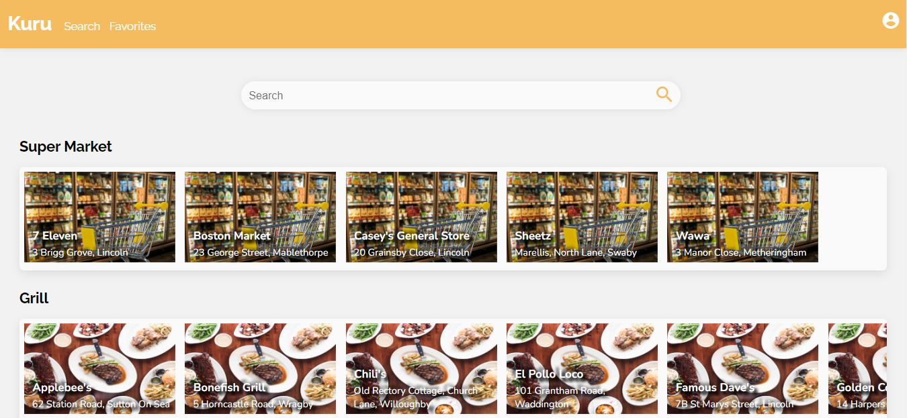
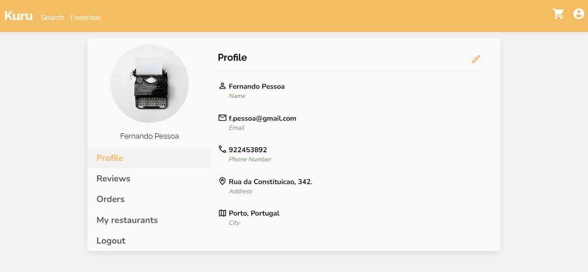
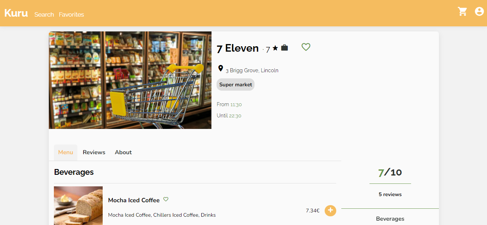
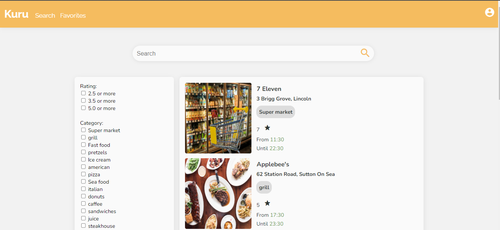
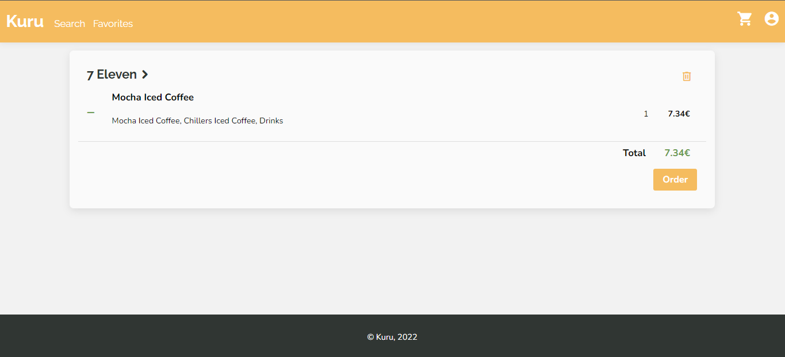
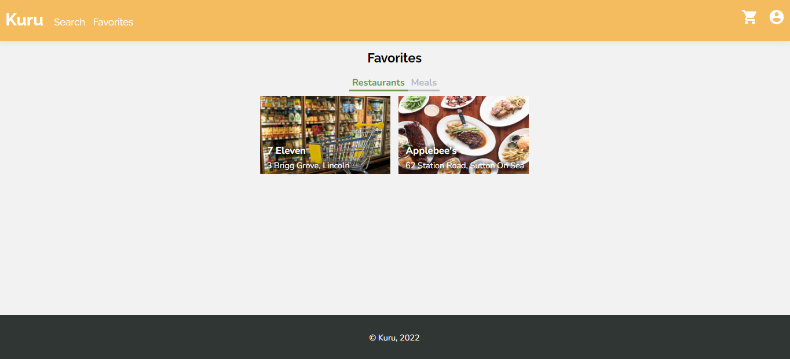

# Kuru

Kuru is a food delivery website. Users can look for restaurants and order food online.
This project was part of the Web Languages and Technologies course unit at FEUP. This was our first contact with web development. To create it we used different languages and technologies: HTML & CSS, PHP, SQLite & Javascript.

## UI

| []()                                                                   | []()                                                             | []() |
|:---:|:---:|:---:|
| Home Page | User Profile | Restaurant Page |

| []()                                                        | [](/res/discoverPage.png)                                               | []() |
|:---:|:---:|:---:|
| Search Page | Cart Page | Favorites Page |


## Features

- [x] Register
- [x] Login/Logout
- [x] Edit Profile
- [x] Add Restaurant
- [x] Edit Restaurant
- [x] Add Dishes
- [x] Add Dish Photo
- [x] List Reviews
- [ ] Restaurant Owner Can Answer to Review
- [x] List Customer Orders
- [x] Change Order State
- [x] Search Restaurants
- [x] Order Dishes
- [x] List My Orders
- [x] Mark Restaurant as Favourite
- [x] Mark Dish as Favourite
- [x] Customer Can Leave a Review

## Credentials
```
Restaurant Owner
Email: f.pessoa@gmail.com 
Password: amocamoes
```

## Steps to run

Assuming PHP and sqlite are properly set up:

```
cd src
php -S localhost:9000
``` 

